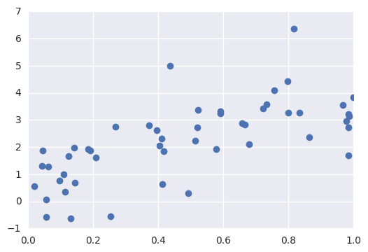
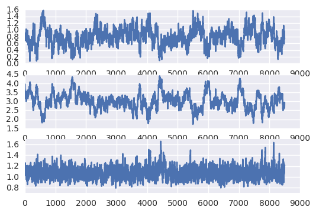

```python
import numpy as np
import pylab as pb
import scipy.stats 
import seaborn as sns
%matplotlib inline
```

Będziemy estymować prostą regresję postaci: $y = 1 + 3*x + \epsilon$, gdzie $\epsilon \sim \mathcal{N}(0, \tau)$ where $\tau = \frac{1}{\sigma^2}$.


```python
x = np.random.rand(50)
e = np.random.normal(0,1, 50)
```


```python
y = 1 + 3*x + e
```


```python
pb.plot(x, y, 'o')
```


    [<matplotlib.lines.Line2D at 0x11acb6c90>]





Noninformative priors for parameters - normal for alpha and beta and gamma for tau (classic approach):


```python
alpha = scipy.stats.norm.rvs(size= 100, scale= 1000)
beta = scipy.stats.norm.rvs(size= 100, scale=1000)
gamma = scipy.stats.gamma.rvs(a = 1, size= 100)
pb.hist(alpha, normed=True, label = 'normal')
#pb.hist(beta, normed=True)
#pb.hist(gamma, normed=True, label = 'gamma')
pb.legend()
```


    <matplotlib.legend.Legend at 0x11ac20150>


```python
alpha = 0
beta = 0
tau = 1
```


```python
def logn(x, y, alpha, beta, tau):
    s = y - (alpha + beta * x)
    ss = scipy.stats.norm.logpdf(s, scale = tau) 
    return np.sum(ss) + scipy.stats.norm.logpdf(alpha, scale = 1000) \
       + scipy.stats.norm.logpdf(beta, scale = 1000) + scipy.stats.gamma.logpdf(tau, a = 0.01)
```


```python
N = 10000 # number of steps
old = [alpha, beta, tau]
record = np.zeros((0,3))
for ii in range(N):
    # sampling new parameters 
    new = old + scipy.stats.multivariate_normal.rvs(size=1, cov = np.identity(3) * 0.01) # np.identity(3) * 0.5)
    while new[2] <= 0:
        new[2] = old[2] + scipy.stats.norm.rvs(scale = 0.03)
    
    prob = logn(x, y, new[0], new[1], new[2]) - logn(x, y, old[0], old[1], old[2])
    
    # checking the rejection
    accept = np.random.rand() <  np.exp(prob)
    record = np.vstack((record, old))
    
    # sampling
    if accept:
        old = new
    else:
        pass # keep old parameters
```


```python
pb.figure(1,figsize=(12, 3))
pb.subplot(131)
sns.distplot(record[2000:,0], label='ds')
pb.legend()
pb.subplot(132)
sns.distplot(record[2000:,1])
pb.subplot(133)
sns.distplot(record[2000:,2])

```


    <matplotlib.axes._subplots.AxesSubplot at 0x124849f90>


```python
print('Srednia wartosc parametrow:', np.mean(record[1500:,0]),  np.mean(record[1500:,1]), np.mean(record[1500:,2]))
```

    ('Srednia wartosc parametrow:', 0.79617467223285299, 3.0148463510001178, 1.0739462606195302)


```python
pb.figure(1)
pb.subplot(311)
pb.plot(record[1500:,0])
pb.subplot(312)
pb.plot(record[1500:,1])
pb.subplot(313)
pb.plot(record[1500:,2])
```


    [<matplotlib.lines.Line2D at 0x124d35ed0>]





```python

```
